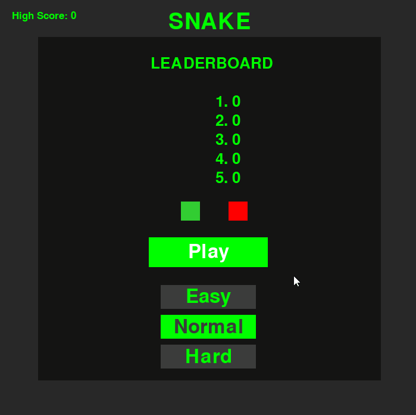

# Snake

The classic Snake arcade game, written in Python with [pygame](https://www.pygame.org/).
Steer the snake around the board, eat apples to grow and score points, and avoid
running into the walls or your own tail. The longer you survive, the faster it gets.



## Features

- Three difficulty levels (Easy, Normal, Hard) that control how quickly the game speeds up
- Levels that increase every five apples eaten
- Score that grows faster with each apple you eat
- Persistent all-time high score
- Top-five leaderboard saved between sessions
- Menu and in-game music plus sound effects
- Full keyboard control, with mouse support in the menu

## Requirements

- Python 3.8 or newer
- pygame

## Installation

1. Clone the repository:

   ```bash
   git clone https://github.com/mattmcgarrity/snake.git
   cd snake
   ```

2. Install pygame:

   ```bash
   pip install pygame
   ```

## Running the game

Run the game from inside the project folder, since it loads its sounds and
score files using relative paths:

```bash
python snakegame.py
```

## How to play

### Menu

| Input                     | Action                                |
| ------------------------- | ------------------------------------- |
| `Enter` or click **Play** | Start a game                          |
| `Up` / `Down` arrows      | Change the selected difficulty        |
| Click a difficulty button | Select that difficulty                |
| `Q`                       | Quit                                  |

Normal is selected by default.

### In game

| Input        | Action                |
| ------------ | --------------------- |
| Arrow keys   | Steer the snake       |

The snake cannot reverse directly into its own body. The game ends when the snake
hits the edge of the board or itself.

### Scoring and speed

- Each apple is worth `10 x 1.5 x (apples eaten so far)` points, so later apples
  are worth more.
- Every 5 apples, the level goes up and the game speeds up.
- The speed increase per level depends on the difficulty:

  | Difficulty | Speed multiplier per level |
  | ---------- | -------------------------- |
  | Easy       | 1.02x                      |
  | Normal     | 1.05x                      |
  | Hard       | 1.07x                      |

## Project structure

| File                     | Purpose                                                            |
| ------------------------ | ------------------------------------------------------------------ |
| `snakegame.py`           | Entry point. Contains `SnakeGame`, which runs the main loop        |
| `snake.py`               | `Snake` class: movement, body tracking, drawing, collisions        |
| `apple.py`               | `Apple` class: spawning and drawing the apple                      |
| `settings.py`            | `Settings` class: screen, colors, speed, scoring, and sounds       |
| `game_stats.py`          | `GameStats` class: current score, game state, and high score       |
| `scoreboard.py`          | `Scoreboard` class: draws the title, score, level, and high score  |
| `leaderboard.py`         | `Leaderboard` class: stores and draws the top five scores          |
| `button.py`              | `Button` and `DifficultyButton` classes for the menu               |
| `assets/`                | Music and sound effects                                            |
| `snake_high_score.json`  | Saved all-time high score                                          |
| `snake_top_five.json`    | Saved top-five scores, one per line                                |

## Customizing

Most gameplay values live in `settings.py`, including board size, tile size, colors,
starting speed, score multiplier, and the speed-up rate for each difficulty.

## Resetting scores

To reset your scores, edit the two saved score files:

- `snake_high_score.json`: replace the contents with `0`
- `snake_top_five.json`: replace the contents with five lines of `0`

## Acknowledgements

Coded in Python by [Matt McGarrity](https://github.com/mattmcgarrity).
